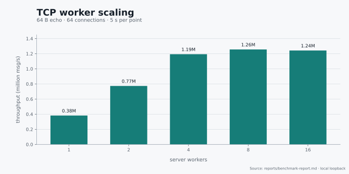
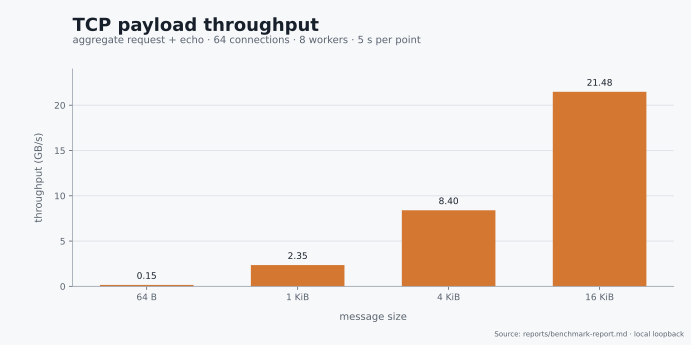
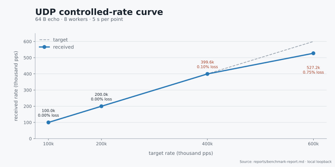

# uring-proactor

> A compact C++23 TCP/UDP Proactor framework built on io_uring.

[English](#english) | [中文](#中文)

`uring-proactor` is a Linux networking framework focused on predictable resource ownership and a small hot path. Each worker owns its `IoRing`, provided-buffer ring, write pool, sockets, and channels. Completion events resume C++23 coroutines without moving resources between workers.

> The project is experimental. Validate its behavior and capacity against your workload before production use.

## English

### Highlights

- **Multishot receive pipeline:** TCP accept/receive and UDP `recvmsg` use
    io_uring multishot operations with per-worker provided-buffer rings; consumed
    buffers are recycled back to the kernel.
- **Shared-nothing workers:** each worker owns its `SO_REUSEPORT` socket,
    `IoRing`, receive ring, write pool, and channels. Hot-path resources never
    migrate between workers.
- **Embedded coroutine state:** each channel stores its read and write coroutine
    frames, and CQE tokens resume them without heap-allocating handler frames.
- **Ordered TCP writes:** one write SQE is in flight per connection; queued
    blocks are gathered with `writev`, and short completions consume only the
    acknowledged prefix before continuing.
- **Transactional UDP sends:** payload buffers and `msghdr` slots are committed
    as one datagram or rolled back together, so resource exhaustion cannot emit a
    truncated packet.
- **Optional affinity mode:** SQPOLL ring affinity, worker CPU pinning, and
    NUMA-preferred allocation are enabled together for dedicated-worker setups.

### Requirements

| Component | Requirement |
|:--|:--|
| Operating system | Linux |
| Kernel | 6.0+ for multishot `recv`/`recvmsg`; a current 6.x kernel is recommended |
| Compiler | GCC 13+ or equivalent C++23 coroutine support |
| Build system | CMake 3.20+ |
| Libraries | liburing, libnuma, pthreads |

Ubuntu/Debian:

```bash
sudo apt-get update
sudo apt-get install -y build-essential cmake pkg-config liburing-dev libnuma-dev
```

### Quick start

```bash
cmake -S . -B build -DCMAKE_BUILD_TYPE=Release
cmake --build build -j"$(nproc)"
./build/echo_server --threads 4
```

The example listens on TCP `127.0.0.1:8080` and UDP `127.0.0.1:8081`:

```bash
printf 'hello\n' | nc -N 127.0.0.1 8080
printf 'hello\n' | nc -u -w1 127.0.0.1 8081
```

| Build target | Purpose |
|:--|:--|
| `liburing_proactor.a` | Static framework library |
| `echo_server` | TCP/UDP echo server and benchmark target |
| `bench` | Same-host TCP/UDP benchmark client |
| `connection_scale` | Epoll-based TCP connection-scale validator |

### Architecture

```text
TcpServer / UdpServer
        |
        +-- worker 0: IoRing + BufRing + BufPool + channels
        +-- worker 1: IoRing + BufRing + BufPool + channels
        `-- worker N: IoRing + BufRing + BufPool + channels

kernel CQE -> Token::complete() -> coroutine resume -> application callback
```

`SO_REUSEPORT` gives each worker an independent listener or UDP socket. A worker never borrows another worker's buffers or channels when its local pool reaches capacity. Applications therefore need to size per-worker resources for their traffic distribution.

TCP maintains byte-stream ordering with at most one write SQE in flight per connection. Queued blocks are gathered into `writev`; a short completion consumes only the acknowledged prefix and resubmits the remainder.

UDP construction is transactional. If a datagram cannot fit the configured queue or iovec limits, it is discarded without exposing a partial packet and all pending resources are returned.

### Minimal TCP server

```cpp
#include "net/channel.hpp"
#include "net/server.hpp"

class EchoServer final : public TcpServer
{
public:
    EchoServer()
        : TcpServer(8080, 4, 2048, 16, 1024, 2048, 512) {}

    void on_read(TcpChannel &channel) override
    {
        const unsigned int available = channel.read_buf_.readable_bytes();
        auto *result = channel.peek(available);
        if (!result)
            return;

        unsigned int accepted = 0;
        for (unsigned int i = 0; i < result->count; ++i)
        {
            if (!channel.append(result->data[i], result->size[i]))
                break;
            accepted += result->size[i];
        }
        if (accepted != 0)
        {
            channel.consume(accepted);
            if (!channel.submit())
                return;
        }
    }
};
```

Pool sizes, ring sizes, channel capacities, and queue depths are fixed and must be positive powers of two. Applications must check `append()`, `prepend()`, and `submit()`. A failed UDP submit discards the current datagram and returns its resources; a failed TCP submit leaves pending bytes available for retry.

### Performance

Run the protocol-isolated local loopback suite with:

```bash
./run-benchmarks.sh          # full matrix and Markdown report
./run-benchmarks.sh --quick  # reduced one-second smoke matrix
./run-benchmarks.sh --ci     # configure and build only
```

The full suite validates 10,000 concurrent TCP connections and measures TCP worker, connection, and payload scaling plus UDP worker, controlled-rate, and sender scaling. Each run generates local raw output at `reports/benchmark-report.md`; the report directory is ignored by Git.

Latest full run:

| Item | Value |
|:--|:--|
| Date | 2026-08-06 |
| CPU | Intel Core Ultra X7 358H, 16 logical CPUs, no SMT |
| Kernel / compiler | Linux 7.1.6 / GCC 15.3.0 |
| Build | Release |
| Topology | Client and server on the same host, no CPU affinity |
| Selected server workers | 8 |
| Duration | 5 seconds per throughput point |

#### TCP worker scaling



At 64-byte messages and 64 connections, throughput scales from `382k msg/s` with one worker to `1.26M msg/s` with eight workers. Sixteen workers do not improve this same-host result because the client, server, scheduler, and loopback stack compete for the same CPUs.

#### TCP payload throughput



With 64 connections and eight workers, aggregate request-plus-echo traffic reaches `8.40 GB/s` at 4 KiB and `21.48 GB/s` at 16 KiB. The connection-scale test established and echoed all 10,000 connections with zero failures; server RSS was approximately `497 MiB` under that deliberately preallocated configuration.

#### UDP controlled rate



The controlled curve is the sustainable-load view: 100k and 200k packets per second complete without loss, 400k completes at `0.10%` loss, and the 600k target produces an actual `527k recv pps` at `0.75%` loss. Unlimited sender tests intentionally measure the overload boundary, not a lossless operating point.

UDP sockets request 4 MiB receive and send buffers. Each worker uses the measured resource set `BufRing=512`, `BufPool=1024`, `MsghdrPool=256`, write queue `64`, and io_uring depth `512`. Larger user-space pools retained a deeper backlog and reduced saturated throughput in A/B tests.

> These are local loopback results, not physical-NIC throughput. They include client work, server work, scheduling, and the Linux networking stack. Compare runs only with equivalent hardware, kernel, power policy, build, worker count, and test parameters.

Useful overrides:

```bash
DURATION=10 SELECTED_WORKERS=4 ./run-benchmarks.sh
SCALE_CONNECTIONS=20000 SELECTED_WORKERS=8 ./run-benchmarks.sh
WORKER_POINTS="1 4 8 16" TCP_CONNECTION_POINTS="1 64 512" ./run-benchmarks.sh
BUILD_DIR=build-clang CXX=clang++ ./run-benchmarks.sh --ci
```

### Repository layout

```text
.github/workflows/       continuous integration
assets/benchmarks/       benchmark charts used by this README
benchmarks/              echo server and benchmark clients
include/                 public headers
scripts/benchmarks/      benchmark workflow modules
src/                     framework implementation
CMakeLists.txt           CMake build definition
Dockerfile               container build definition
README.md                 project documentation
run-benchmarks.sh        benchmark entry point
```

### License

This is a personal learning project released under the MIT License.

## 中文

`uring-proactor` 是一个基于 io_uring 和 C++23 协程的 Linux TCP/UDP Proactor 框架。每个 worker 独占 `IoRing`、provided-buffer ring、写缓冲池、socket 和 channel；I/O 热路径不跨 worker 借用资源，容量与过载行为保持明确。

### 核心特性

- **Multishot 接收链路：** TCP accept/recv 与 UDP `recvmsg` 使用 io_uring
    multishot 操作和每 worker 独占的 provided-buffer ring；消费后的 buffer
    会回收到内核。
- **Shared-nothing worker：** 每个 worker 独占 `SO_REUSEPORT` socket、
    `IoRing`、接收 ring、写缓冲池和 channel，热路径资源不跨 worker 迁移。
- **内嵌协程状态：** 每个 channel 内部保存读写协程帧，CQE token 直接恢复
    协程，无需在堆上分配 handler frame。
- **TCP 有序写入：** 每条连接只保留一个在途写 SQE；排队的数据通过
    `writev` 聚合，短写仅消费内核确认的前缀，再继续提交剩余数据。
- **UDP 整包事务：** payload buffer 与 `msghdr` slot 作为一个报文共同提交
    或共同回滚，资源不足时不会发出截断报文。
- **可选亲和模式：** 面向独占 worker 的部署，可同时启用 SQPOLL ring
    亲和、worker CPU 绑定和 NUMA 优先内存分配。

### 环境要求

| 组件 | 要求 |
|:--|:--|
| 操作系统 | Linux |
| 内核 | multishot `recv`/`recvmsg` 要求 6.0+，推荐使用较新的 6.x 内核 |
| 编译器 | GCC 13+ 或具备相应 C++23 协程支持的编译器 |
| 构建系统 | CMake 3.20+ |
| 依赖库 | liburing、libnuma、pthreads |

Ubuntu/Debian：

```bash
sudo apt-get update
sudo apt-get install -y build-essential cmake pkg-config liburing-dev libnuma-dev
```

### 快速开始

```bash
cmake -S . -B build -DCMAKE_BUILD_TYPE=Release
cmake --build build -j"$(nproc)"
./build/echo_server --threads 4
```

示例服务默认监听 TCP `127.0.0.1:8080` 和 UDP `127.0.0.1:8081`：

```bash
printf 'hello\n' | nc -N 127.0.0.1 8080
printf 'hello\n' | nc -u -w1 127.0.0.1 8081
```

| 构建目标 | 用途 |
|:--|:--|
| `liburing_proactor.a` | 框架静态库 |
| `echo_server` | TCP/UDP echo 服务及性能测试目标 |
| `bench` | 同机 TCP/UDP 性能测试客户端 |
| `connection_scale` | 基于 epoll 的 TCP 连接规模验证工具 |

### 架构

```text
TcpServer / UdpServer
        |
        +-- worker 0: IoRing + BufRing + BufPool + channels
        +-- worker 1: IoRing + BufRing + BufPool + channels
        `-- worker N: IoRing + BufRing + BufPool + channels

kernel CQE -> Token::complete() -> coroutine resume -> application callback
```

`SO_REUSEPORT` 为每个 worker 提供独立的监听 socket 或 UDP socket。当本地资源池达到容量上限时，worker 不会借用其他 worker 的 buffer 或 channel。因此，应用需要根据流量分布配置每个 worker 的资源容量。

TCP 每条连接最多保留一个在途写 SQE，以维持字节流顺序。排队的数据块通过 `writev` 聚合；短写完成时只消费内核确认的前缀，并重新提交剩余数据。

UDP 报文构造具有事务语义。如果报文超出队列或 iovec 限制，则整包丢弃，不会暴露部分报文，同时回收所有 pending 资源。

### 最小 TCP 服务

```cpp
#include "net/channel.hpp"
#include "net/server.hpp"

class EchoServer final : public TcpServer
{
public:
    EchoServer()
        : TcpServer(8080, 4, 2048, 16, 1024, 2048, 512) {}

    void on_read(TcpChannel &channel) override
    {
        const unsigned int available = channel.read_buf_.readable_bytes();
        auto *result = channel.peek(available);
        if (!result)
            return;

        unsigned int accepted = 0;
        for (unsigned int i = 0; i < result->count; ++i)
        {
            if (!channel.append(result->data[i], result->size[i]))
                break;
            accepted += result->size[i];
        }
        if (accepted != 0)
        {
            channel.consume(accepted);
            if (!channel.submit())
                return;
        }
    }
};
```

pool 大小、ring 大小、channel 容量和 queue depth 都是固定值，且必须是正的 2 的幂。应用必须检查 `append()`、`prepend()` 和 `submit()` 的返回值。UDP submit 失败会丢弃当前报文并回收资源；TCP submit 失败会保留 pending 字节，供后续重试。

### 性能测试

使用以下命令运行协议隔离的本机 loopback 测试：

```bash
./run-benchmarks.sh          # 完整矩阵及 Markdown 报告
./run-benchmarks.sh --quick  # 一秒快速检查矩阵
./run-benchmarks.sh --ci     # 仅配置与编译
```

完整脚本验证 10,000 条并发 TCP 连接，并测试 TCP worker、连接数和消息大小扩展，以及 UDP worker、受控速率和 sender 扩展。每次运行都会在本地生成 `reports/benchmark-report.md`；该报告目录已被 Git 忽略。

最新完整测试环境：

| 项目 | 参数 |
|:--|:--|
| 日期 | 2026-08-06 |
| CPU | Intel Core Ultra X7 358H，16 个逻辑 CPU，无 SMT |
| 内核 / 编译器 | Linux 7.1.6 / GCC 15.3.0 |
| 构建类型 | Release |
| 测试拓扑 | 客户端与服务端同机运行，未绑定 CPU |
| 服务端 worker | 8 |
| 测试时长 | 每个吞吐测试点 5 秒 |

#### TCP worker 扩展


在 64 B 报文、64 条连接下，吞吐从 1 worker 的 `382k msg/s` 提升到 8 workers 的 `1.26M msg/s`。16 workers 未继续提升同机测试结果，因为客户端、服务端、调度器和 loopback 网络栈会竞争相同的 CPU。

#### TCP 消息吞吐


在 64 条连接和 8 workers 下，request + echo 聚合流量在 4 KiB 报文时达到 `8.40 GB/s`，在 16 KiB 时达到 `21.48 GB/s`。连接规模测试成功建立 10,000 条连接并全部完成 echo，失败数为 0；在该预分配配置下，服务端 RSS 约为 `497 MiB`。

#### UDP 受控速率


受控曲线用于观察可持续负载：100k 和 200k pps 无丢包，400k pps 丢包 `0.10%`；600k 目标速率下实际接收约 `527k pps`，丢包 `0.75%`。无限速 sender 测试用于测量过载边界，不代表无损工作点。

UDP socket 请求 4 MiB 收发缓冲。每个 worker 使用实测资源配置：`BufRing=512`、`BufPool=1024`、`MsghdrPool=256`、写队列 `64`、io_uring depth `512`。A/B 测试表明，更大的用户态资源池会保留更深的积压并降低饱和吞吐。

> 以上是本机 loopback 结果，不是物理网卡吞吐。数字包含客户端、服务端、调度和 Linux 网络栈开销。比较不同测试时，应保持硬件、内核、电源策略、构建类型、worker 数量和测试参数一致。

常用参数覆盖：

```bash
DURATION=10 SELECTED_WORKERS=4 ./run-benchmarks.sh
SCALE_CONNECTIONS=20000 SELECTED_WORKERS=8 ./run-benchmarks.sh
WORKER_POINTS="1 4 8 16" TCP_CONNECTION_POINTS="1 64 512" ./run-benchmarks.sh
BUILD_DIR=build-clang CXX=clang++ ./run-benchmarks.sh --ci
```

### 仓库结构

```text
.github/workflows/       持续集成
assets/benchmarks/       README 使用的性能图表
benchmarks/              echo 服务与性能测试客户端
include/                 公共头文件
scripts/benchmarks/      性能测试流程模块
src/                     框架实现
CMakeLists.txt           CMake 构建定义
Dockerfile               容器构建定义
README.md                 项目文档
run-benchmarks.sh        性能测试入口
```

### 许可证

本项目仅用于个人学习，采用 MIT 许可证。
